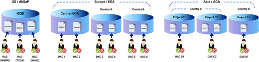

# 要旨

オープンアクセスのヒト配列データは、すでに International Nucleotide Sequence Database Collaboration（INSDC）のリソースを通じて発見できる。アジアの生物医学研究にとってより難しいのは、各国のアーカイブ、バイオバンク、プロジェクト固有の Data Access Committee（DAC）に分散したままの、制限付きアクセス（controlled-access, CA）のヒト遺伝子型・表現型データおよびコホートデータを発見し、利用申請することである。シンガポールで開催された MedHackathon Asia 2026 では、日本、インド、タイ、シンガポール、フィリピンからの参加者が、単一の中央集権的なデータ保管を前提とせずに、連合アジアゲノム・表現型アーカイブ（Federated Asian Genome-Phenotype Archive, AGA）が地域のデータ発見可能性をどう高められるかを検討した。MedHackathon Asia 2025 の成果、ならびに dbGaP、European Genome-phenome Archive（EGA）とその Federated EGA ネットワーク、Japanese Genotype-phenotype Archive（JGA）から得られた教訓を踏まえ、レポジトリモデルを比較し、各国のアクセス体制を整理し、二段階のロードマップを示した。まず JGA やインドの INDA-CA など既存の CA アーカイブのインデックスを連合し、次に国家ゲノムプロジェクトやバイオバンクを共有カタログにどう載せるかを設計する。AGA の主たる役割は、どこにどのようなデータがどれくらいあり、どのようなアクセス条件で、どの DAC を通じて利用できるかを答える、ヒトにも AI にも使いやすいカタログであること、一方で長期的なアクセス可能性の確保はメンバーアーカイブと各プロジェクトに残る、と提案する。

**キーワード:** 連合アジアゲノム・表現型アーカイブ；制限付きアクセス；Data Access Committee；MedHackathon Asia；ゲノムデータ共有

# はじめに

アジアのゲノム資源は急速に拡充している一方で、研究者はなお基本的な問いに答えることに苦戦している。アジアにどのようなヒト研究データがあり、各タイプがどれくらい利用可能で、どうアクセス申請すればよいのか。MedHackathon Asia 2025 では、各国データセットの存在そのものが国境を越えて日常的に共有されていないことが浮き彫りになった [@citesAsRelated:MedHackathon2025]。2026 年の会合では、その議論を具体的なインフラに焦点を移して継続した。すなわち、各国・各機関のガバナンスを尊重しつつ、制限付きアクセスデータの発見を改善する連合アジアゲノム・表現型アーカイブ（AGA）である [@citesAsSourceDocument:MedHackathon2026Web]。

INSDC の連携のもと、論文で用いられるヒト研究データをアーカイブする姉妹リソースとして、米国では dbGaP [@citesAsAuthority:Tryka2014; @citesAsAuthority:Mailman2007]、欧州では EGA [@citesAsAuthority:Freeberg2022; @citesAsAuthority:Lappalainen2015]、日本では JGA [@citesAsAuthority:Kodama2015] が運用されている。これらのアーカイブは安定した識別子を付与し、引用を支え、再利用を DAC 経由で案内する。Federated EGA はさらに、各国ノードがデータ管轄をローカルに保ちつつ、共有の発見レイヤを公開できることを示している [@citesAsPotentialSolution:DAltri2025]。AGA がアジアで目指すのも近い目標である。単一の連合アーキテクチャの複製ではなく、INSDC に整合した CA アーカイブと、それらの外にある大規模バイオバンク・国家ゲノムプロジェクトの双方をまたぐ地域カタログを可能にすることである [@citesAsRelated:MedHackathon2025; @citesAsAuthority:Arita2021]。

オープンアクセス（OA）データは、すでに Sequence Read Archive（SRA）、European Nucleotide Archive（ENA）、DDBJ Sequence Read Archive（DRA）を通じて発見可能である。したがって本報告は CA データに焦点を当て、どう見つけ、アクセス要件をどう記述し、申請者を正しい DAC へどう案内するかを扱う。

# 背景：参照となる遺伝子型・表現型アーカイブ

表1は、会合で議論した三つの参照 CA アーカイブをまとめたものである。カタログ件数の概数は議論時点の公開ポータルに基づくスナップショットであり、監査済み統計ではない [@citesAsDataSource:dbGaPWeb; @citesAsDataSource:EGAWeb; @citesAsDataSource:JGAWeb]。

Table: MedHackathon Asia 2026 で議論した主要な遺伝子型・表現型アーカイブのスナップショット比較。

| アーカイブ | 地域 / 運用 | 公開カタログ概数 | DAC モデル（概要） |
| ------- | ----------------- | ------------------------------- | ---------------------- |
| dbGaP | 米国 / NCBI | 約 3,579 studies；約 15,541 phenotype datasets；約 2,122 molecular datasets；約 14 DACs | 主に研究を管轄する NIH 機関単位で DAC が組織され、study ごとではない |
| EGA / Federated EGA | 欧州 / EMBL-EBI（＋各国ノード） | 約 9,962 studies；約 13,779 datasets；約 3,208 DACs | 中央および各国ノード；データセットまたは study 管理主体ごとに DAC があることが多い |
| JGA / NBDC ヒトデータベース | 日本 / NIG-DDBJ（＋ NBDC） | 約 396 studies；約 979 datasets；1 DAC | 単一の機関 DAC（NBDC ヒトデータベース） |

これらのシステムのアーキテクチャ上の対比を、MedHackathon Asia 2025 コミュニティ報告に基づく図1に示す。dbGaP は複数の機関 DAC をもつ中央集権レポジトリ、Federated EGA は連携した各国ノード、アジアの想定モデルは国・プロジェクト単位のアーカイブが分散しつつもまとめて発見可能になる姿である [@citesAsRelated:MedHackathon2025]。

{ width=100% }

Federated EGA はまた、AGA が想定すべき運用上のリスクも示している。DAC が増えすぎる場合や、principal investigator（PI）が事実上 DAC を兼ねる場合、連絡経路が途切れ、一度認められたアクセスが利用不能になることがある [@discusses:DAltri2025; @discusses:Freeberg2022]。Global Alliance for Genomics and Health（GA4GH）が策定した標準は、メタデータ、アクセス、認証のための共有語彙を提供しており、AGA は実務上可能な限り再利用すべきである [@citesAsRecommendedReading:Rehm2021]。

# AGA のニーズと設計上の課題

参加者は、AGA がまず各国の study・コホートに関連するデータセットと DAC のカタログであるべきだという点で一致した。アジアの研究データが一箇所にリストされ検索可能になれば、再利用は現実的になり、データ生産者・利用者双方にとってデータセットの可視性も向上する。第二の、将来を見据えたニーズは AI 支援の発見である。研究者が「私は X を研究したいが、利用可能なアジアのデータはどこにあるか？」と問い、カタログと対応する DAC 申請手続きへの実用的な指針を得られるようにすることである。

カタログ設計には未解決の課題が残る。第一に、JGA や EGA がすでに公開しているメタデータは、ヒトおよび機械による検索に必要十分か。大規模コレクションに対するファセットや分布サマリーは現状では弱いように見える。第二に、数千の表現型パラメータをもつコホートを、非現実的なキュレーション負担なしに登録できる粒度でどう要約するか。東北メディカル・メガバンク機構（ToMMo）のような資源は、一つの巨大データセットを持つ一つのプロジェクトとも、目的別の多数のサブセットとも捉えられる。PRECISE や ToMMo のようなコホートについては、承認された各データ利用申請が研究目的と対応するサブセットを定義し、それらが後に AGA の第一級レコードになりうる、という作業仮説が示された。共通オントロジーと GA4GH 整合のメタデータを早期に採用すれば、ファセット検索は改善しうる [@citesAsRecommendedReading:Rehm2021]。

メンバーシップとガバナンスにも現実的なモデルが必要である。国ごとに代表機関を一つに決める方式は、短期間では成功しにくい。日本だけを見ても、JGA、ToMMo、バイオバンク・ジャパン（BBJ）、GEM Japan（GeMJ）など独立運用の資源それぞれに参加経路が必要になりうる。アクセス規則自体も多様であり、カタログ上で明示的に記述すべきである。表2は議論で用いた暫定的なアクセス要件コードである。

Table: DAC 承認に加えて求められる追加アクセス要件の暫定コード（Tier 3 修飾子）。

| コード | 意味 |
| ---- | ------- |
| A | データアクセスに現地の共同研究者が必要 |
| A+ | A に加え、現地の臨床医の関与が必要（例：タイの臨床データ） |
| B | アカデミアからのみアクセス可能 |
| C | 産業界からアクセス可能 |
| D | 研究の PI が許可すればアクセス可能 |

閲覧については、AGA は年齢・性別・疾患・組織・手法・データタイプ別の階層的サマリーと統計を提供し、選択されたデータセットから正しい DAC へ利用者を案内すべきである。ホスティングは軽量なプロトタイプ（例：GitHub Pages）から始め、後にメンバー機関でのミラーポータルへ移せる。AI 機能は API 課金を増やし、ローカル推論を用いる場合はハードウェアコストも上がる。

# 各国の状況

2026年7月29日、日本（JGA、ToMMo、GeMJ）、インド（Indian Biological Data Centre, IBDC）、タイ（Genomics Thailand）、シンガポール（PRECISE）、フィリピン（Filipinome）からの参加者が各国の状況を比較した。議論の中心は Tier 2（DAC を通じた制限付きアクセス）と Tier 3（DAC 承認に加え、追加の現地条件）であり、Tier 1（オープンアクセス）は主に INSDC および関連 OA レポジトリが担うものとして扱った。

Table: MedHackathon Asia 2026 の議論に基づく国・プロジェクトのスナップショット（定性的；完全な目録ではない）。

| 国（議論参加者） | プロジェクト / 資源 | Tier とアクセスのメモ | 保有データ（例） | 海外からの申請 |
| -------------------- | ------------------ | --------------------- | -------------------- | -------------------------- |
| インド（Shailesh Kumar） | IBDC | Tier 2；IBDC が DAC | 正常およびがんのヒトゲノミクス／マルチオミックス；インド版 GTEx 的な取り組み | INDA / INDA-CA の文脈で議論 |
| フィリピン（Francis Tablizo） | Filipinome（Philippine Genome Center） | Tier 3-D；現状一つのプロジェクトで PI 承認が必要 | ゲノムデータと臨床情報 | 十分には特定されず |
| タイ（Jakris Eu-ahsunthornwattana） | Genomics Thailand | 臨床データは Tier 3-A+（臨床医との共同） | Genomics Thailand | 可能 |
| 日本（Toshiaki Katayama, Soichi Ogishima, Yosuke Kawai） | JGA | 機関 DAC による Tier 2 | ゲノム、トランスクリプトーム、エクソーム、アレイ、空間トランスクリプトームなど | 可能 |
| 日本 | ToMMo | Tier 2 として独自 DAC（外部専門家を含む）；ToMMo 研究者との共同なら Tier 3-A | コホート、ゲノム、マルチオミックス、健康情報 | 検討中 |
| 日本 | AMED 支援の疾患研究 | しばしば Tier 3-D；多くのデータセットは個別 PI が管理 | 疾患研究データ | ケースバイケース |
| シンガポール（Nicolas Bertin） | PRECISE / TRUST / MOH | Tier 2；TRUST DAC が下位 DAC へ振り分け可能；PRECISE への直接申請も可 | PRECISE：ゲノム／UK Biobank 類似データ；MOH：選択された EHR；TRUST：環境その他のデータ | 要確認 |

繰り返し現れたテーマは、INSDC に整合した登録アーカイブと、独自 DAC と大規模縦断コレクションを持つ国家的データ生産者との区別である。国家コホート全体を一つのカタログレコードとして扱うと検索が効かないため、より細かい内訳が必要である。Day 2 で浮上した実務的な問いは、したがって次である。今日、アジア各国の研究者は CA ヒト研究データを実際にどこへ登録しているのか。インドについては、IBDC が INDA（SRA 相当）と INDA-CA（dbGaP 相当）を運用し、後者の DAC を IBDC 自身が担っていることが、JGA 以外の具体例となった。

# ビジョンとポータル要件

AGA の当面のビジョンは、二系統の資源を一つの視野にまとめ、アジア横断でのヒト研究データの相互利用を促す連合カタログである [@citesAsRelated:FederatedAGARepo]。

第一の系統は INSDC に整合したヒト研究データである。OA 系（SRA、ENA、DRA）と CA 系（dbGaP、EGA、JGA）、および重要な関連・今後のパートナーとしての CNCB（中国）と IBDC（インド、INDA-CA を含む）。ここにはすでに共有の登録・アクセッション慣行があり、最初に連合する最も現実的な骨格となる [@citesAsAuthority:Arita2021]。

第二の系統は、それらのアーカイブの外に主に位置するバイオバンクおよび国家ゲノムデータである。例えば日本の ToMMo、GeMJ、AMED 支援コホート；GenomeIndia；シンガポールの PRECISE；Genomics Thailand；フィリピンの Filipinome；および MedHackathon Asia 2025 論文の表1にまとめられたその他の資源である [@usesDataFrom:MedHackathon2025]。これらは現状、別々のポータル、メタデータモデル、アクセス規則を用いている。共有インデックスがなければ、アジアにどのようなヒトゲノムデータがありどれくらいあるかを一箇所で答えられない。

AGA が支えるべき研究者の旅は、今日の Federated EGA の利用と並行する。カタログで関連データセットを発見し、管轄 DAC を特定して申請し、提供者が用意する環境（trusted research environment、セキュアなクラウド作業空間、またはダウンロード）で解析する [@citesAsPotentialSolution:DAltri2025; @citesAsDataSource:EGAWeb]。したがって AGA の主機能は、国ごとの保有状況の概観を示し、ヒトと AI による効率的な検索を可能にし、申請先を明確にし、一過性のプロジェクトサイトではなく耐久性のあるアーカイブを指し示すことで長期アクセスを助けることである。

# 考察

MedHackathon Asia 2026 の AGA トラックは、アジアにおける「連合」が、保管や法制度の即時均一化を意味しなくてもよいことを明確にした。有用な最初の成果物は共有インデックスである。そのインデックスは、JGA のような論文支援アーカイブだけでなく、アジアで最も価値の高い多くのデータセットが、独自 DAC と共同研究慣行（コード A/A+/B/C/D）をもつ国家バイオバンクに存在するという政治的・運用的現実も表さなければならない。成功を左右するのはカタログの質である。弱いファセットと不透明な DAC 連絡経路は既存システムでも再利用を制限しており、メタデータと API が機械消費向けに設計されなければ、AI エージェントはその弱点を増幅する。

また、国家プロジェクトのデータを既存の CA アーカイブ経由で登録する（例：ToMMo のサブセットを JGA に登録する）か、プロジェクトを独自インデックスを公開する AGA メンバーノードとして認めるか、という戦略的選択もある。両経路は共存しうる。重要な要件は、安定した識別子、十分な要約メタデータ、発見から DAC 申請への耐久性のある経路である。

# 結論

MedHackathon Asia 2026 は、連合 AGA の構想を 2025 年の願望段階から、具体的なカタログとガバナンスのアジェンダへと進めた。参照系（dbGaP、EGA/Federated EGA、JGA）は、アクセッション付き CA アーカイブと DAC ワークフローが大規模に機能しうることを示し、アジア各国のスナップショットは、無視せず符号化すべき異質な Tier 2/3 要件を示した。AGA は、ヒトにも AI にも有用な発見レイヤを優先し、まず既存 CA アーカイブのインデックスを連合し、その後に国家ゲノムプロジェクトとバイオバンクを取り込むべきである。

# 今後の課題

二段階のプログラムを提案する。

ステップ1は、制限付きアクセスアーカイブの連合である。アジア各国で、JGA 以外に CA ヒト研究データの登録を受け入れる機関がどれくらいあるかを調査する。インドの IBDC による INDA / INDA-CA モデルは即座の参照例である。JGA および同種組織がデータセットインデックスを AGA ポータルへどう公開するか（最新一覧を返す API と、必要十分なメタデータを含む JSON スキーマ）を定義する。各国インデックスを集約し、表・ファセット・可視化で検索できるポータルをプロトタイピングする。

ステップ2は、国家ゲノムプロジェクトとバイオバンクの取り込みである。インデックス戦略と必要なメタデータを再検討する。ToMMo については、例えば AGA ノードとしての参加と、JGA 経由でのサブセット登録の両方が現実的である。

この作業は、中間の Zoom 会議、2026年9月の BioHackathon [@citesAsRelated:BioHackathon2026Web]、および次回の MedHackathon Asia を通じて継続する予定である。

# ソフトウェアおよびデータへのリンク

本報告の作業メモと原稿ソースは [https://github.com/ktym/federated-aga](https://github.com/ktym/federated-aga) で管理している [@citesAsSourceDocument:FederatedAGARepo]。イベント情報は [MedHackathon Asia 2026 ウェブサイト](https://medhackathon.github.io/2026/) にある [@citesAsSourceDocument:MedHackathon2026Web]。本報告のために新たな一次ヒトデータセットは生成していない。

# 謝辞

MedHackathon Asia 2026 の主催者と、シンガポールでの会合をホストした PRECISE、ならびに連合 AGA／データ共有ガバナンスの議論に参加したすべての方に感謝する。本報告は MedHackathon Asia 2026 で発展・推進された作業を記述するものである。BioHackrXiv 投稿前に、共著者全員による所属および ORCID の確認が必要である。ここに示した所属は会合参加に基づく暫定である。

# 参考文献
